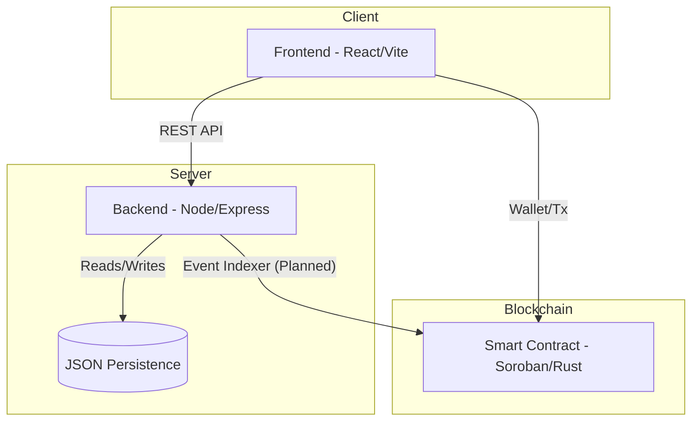

# Contributor Onboarding Guide

Welcome to **Stellar Bounty Board** a contribution-focused Stellar MVP for open source maintainers. This guide will get you from zero to a running local environment, help you understand the codebase, and point you toward your first meaningful contribution.

---

## Table of Contents

1. [What Is This Project?](#1-what-is-this-project)
2. [Quick Visual Overview](#2-quick-visual-overview)
3. [Prerequisites](#3-prerequisites)
4. [Getting the Code](#4-getting-the-code)
5. [Running the Project Locally](#5-running-the-project-locally)
6. [Repository Structure](#6-repository-structure)
7. [Where to Make Common Changes](#7-where-to-make-common-changes)
8. [Understanding the API](#8-understanding-the-api)
9. [Testing Your Changes](#9-testing-your-changes)
10. [Picking Your First Issue](#10-picking-your-first-issue)
11. [Issue Types Explained](#11-issue-types-explained)
12. [Submitting a Pull Request](#12-submitting-a-pull-request)
13. [Architecture & Deployment Links](#13-architecture--deployment-links)
14. [Getting Help](#14-getting-help)

---

## 1. What Is This Project?

Stellar Bounty Board lets open source maintainers fund GitHub issues as Stellar bounties. Contributors can reserve work, submit a PR link, and receive a payout — all tracked through a React dashboard, a Node.js/Express backend, and a Soroban smart contract scaffold.

**Current MVP flow:**

```
Maintainer creates bounty → Contributor reserves it
→ Contributor submits PR link → Maintainer releases payout (or refunds)
```

The backend uses JSON file persistence today, with a clear path to Postgres. The Soroban contract models the same lifecycle on-chain, ready to become the source of truth once wallet authentication is wired up.

---

## 2. Quick Visual Overview

### Demo Video
> [!NOTE]
> [Watch the 2-minute project walkthrough here (Coming Soon)](#)

### System Architecture
This 3-layer diagram shows how the Dashboard, API, and Soroban Contract interact.



---

## 3. Prerequisites

Make sure you have the following installed before you begin:

| Tool | Minimum version | Why it's needed |
|------|----------------|-----------------|
| [Node.js](https://nodejs.org/) | 18+ | Frontend (Vite/React) and backend (Express) |
| npm | 9+ | Workspace scripts (`install:all`, `dev:*`) |
| [Rust](https://www.rust-lang.org/tools/install) | stable (1.75+) | Soroban contract compilation |
| [Stellar CLI (`stellar`)](https://developers.stellar.org/docs/tools/developer-tools/stellar-cli) | latest | Contract build, deploy, and invocation |
| Git | any recent | Cloning and branching |

> **Rust is only required if you plan to work on the smart contract.** Frontend and backend contributors do not need it.

---

## 4. Getting the Code

```bash
# Fork the repo on GitHub, then clone your fork
git clone https://github.com/<your-username>/stellar-bounty-board.git
cd stellar-bounty-board

# Add the upstream remote so you can pull future changes
git remote add upstream https://github.com/ritik4ever/stellar-bounty-board.git
```

---

## 5. Running the Project Locally

### Install all dependencies (one command)

```bash
npm run install:all
```

This runs `npm install` in the root, `frontend/`, and `backend/` in one step.

### Start the backend

```bash
npm run dev:backend
```

The Express API starts at **http://localhost:3001**. It reads from and writes to `backend/data/bounties.json`.

### Start the frontend

Open a second terminal:

```bash
npm run dev:frontend
```

The React/Vite dashboard starts at **http://localhost:3000**. It proxies `/api` requests to the backend automatically — you do not need to configure CORS.

### Verify everything is working

```
http://localhost:3000          → Bounty dashboard UI
http://localhost:3001/api/health  → Should return { "status": "ok" }
http://localhost:3001/api/bounties → Should return [] (empty on first run)
```

### Build for production

```bash
npm run build
```

---

## 6. Repository Structure

```
stellar-bounty-board/
├── frontend/               # React + Vite dashboard
│   ├── src/
│   │   ├── components/     # Reusable UI components
│   │   ├── pages/          # Route-level views
│   │   ├── hooks/          # Custom React hooks
│   │   └── api/            # Typed fetch wrappers for the backend
│   └── vite.config.ts
│
├── backend/                # Node.js + Express REST API
│   ├── src/
│   │   ├── routes/         # Route handlers (bounties, health, open-issues)
│   │   ├── validators/     # Zod schemas for request validation
│   │   └── persistence/    # JSON read/write helpers
│   └── data/
│       └── bounties.json   # Live data file (gitignored in production)
│
├── contracts/              # Soroban Rust smart contract
│   ├── src/
│   │   └── lib.rs          # Contract entry points and escrow logic
│   └── Cargo.toml
│
├── docs/
│   └── issues/             # Pre-written issue drafts ready to open on GitHub
│
├── .github/
│   └── ISSUE_TEMPLATE/     # GitHub issue templates
│
├── CONTRIBUTING.md         # High-level contribution areas
├── ONBOARDING.md           # ← You are here
├── package.json            # Root workspace scripts
└── README.md
```

---

## 7. Where to Make Common Changes

### UI / Frontend changes
**Location:** `frontend/src/`

- To change how bounties are displayed → `components/` and `pages/`
- To add a new page or route → `pages/` + update the router
- To change how API calls are made → `src/api/`
- To add wallet connection UI → `components/` (new component) + hook in `hooks/`

**Stack:** React, TypeScript, Vite. Standard React patterns apply.

---

### Backend / API changes
**Location:** `backend/src/`

- To add a new endpoint → create a handler in `routes/` and register it in the Express app
- To change validation rules → update the Zod schema in `validators/`
- To swap JSON persistence for Postgres → replace helpers in `persistence/`
- To add a new bounty lifecycle action → add a route + update the data model

**Stack:** Node.js, Express, TypeScript, Zod for validation.

---

### Smart contract changes
**Location:** `contracts/src/lib.rs`

The Soroban contract implements the escrow lifecycle:

| Function | What it does |
|----------|-------------|
| `create_bounty` | Locks funds and stores bounty metadata |
| `reserve_bounty` | Assigns a contributor |
| `submit_bounty` | Records a PR submission link |
| `release_bounty` | Transfers escrowed funds to the contributor |
| `refund_bounty` | Returns funds to the maintainer |
| `get_bounty` | Reads current bounty state |

**Build the contract:**

```bash
cd contracts
stellar contract build
```

**Run contract tests:**

```bash
cd contracts
cargo test
```

---

### Documentation changes
**Location:** `docs/issues/` and root `.md` files

Issue drafts in `docs/issues/` are meant to be opened as real GitHub issues. If you spot something missing or outdated, updating these files is a great first contribution.

---

## 8. Understanding the API

Base URLs:

- Direct: `http://localhost:3001`
- Via frontend proxy: `/api` (use this in frontend code)

| Method | Path | Description |
|--------|------|-------------|
| GET | `/api/health` | Liveness check |
| GET | `/api/bounties` | List all bounties |
| POST | `/api/bounties` | Create a new bounty |
| POST | `/api/bounties/:id/reserve` | Reserve a bounty as a contributor |
| POST | `/api/bounties/:id/submit` | Submit a PR link |
| POST | `/api/bounties/:id/release` | Release payout to contributor |
| POST | `/api/bounties/:id/refund` | Refund escrow to maintainer |
| GET | `/api/open-issues` | List contribution-ready issues surfaced in the UI |

You can test endpoints with `curl` or any HTTP client (Insomnia, Postman, Thunder Client):

```bash
# Create a bounty
curl -X POST http://localhost:3001/api/bounties \
  -H "Content-Type: application/json" \
  -d '{"issueUrl": "https://github.com/org/repo/issues/1", "amount": 50, "token": "XLM"}'
```

---

## 9. Testing Your Changes

### Frontend
```bash
cd frontend
npm run lint         # TypeScript + ESLint checks
npm run build        # Catches type errors at compile time
```

> Automated component tests are a tracked contribution opportunity — see the open issues.

### Backend
```bash
cd backend
npm run lint
npm run build
```

Manually test API routes using curl or an HTTP client while `dev:backend` is running.

### Contract
```bash
cd contracts
cargo test           # Unit tests for contract logic
cargo clippy         # Rust linting
```

### End-to-end smoke test (manual)
1. Start both `dev:backend` and `dev:frontend`
2. Open `http://localhost:3000`
3. Create a bounty → reserve it → submit a PR link → release the payout
4. Confirm the status transitions are reflected in the UI and in `backend/data/bounties.json`

---

## 10. Picking Your First Issue

### If you are new to the codebase

Look for issues tagged **`good first issue`**. Good starting points include:

- **Documentation improvements** — clarifying the README, adding JSDoc comments, fixing typos
- **UI polish** — spacing, loading states, empty states, responsive layout tweaks
- **Validation improvements** — adding/tightening Zod schemas on the backend
- **Test coverage** — writing the first unit tests for backend routes or React components

These changes are self-contained, reviewable quickly, and help you learn the structure without needing to understand the full system.

---

### If you are comfortable with the stack

Look for issues tagged **`enhancement`** or **`help wanted`**. High-value areas include:

| Area | What's involved |
|------|----------------|
| **Wallet-authenticated maintainer actions** | Connect Freighter or Albedo wallet; gate `release` and `refund` actions behind a signed transaction |
| **GitHub webhook sync** | Listen for PR merge/close events and automatically update bounty status |
| **Soroban event indexer** | Read emitted contract events and sync on-chain state back to the backend |
| **Postgres persistence** | Replace `backend/data/bounties.json` with a proper database layer |
| **CI and integration tests** | GitHub Actions workflow covering lint, build, and API integration tests |

---

### How to claim an issue

1. Comment on the issue with a brief description of your approach
2. Wait for a maintainer to assign it to you (usually within 24–48 hours)
3. Create a branch: `git checkout -b feat/your-issue-description`
4. Build, test locally, then open a PR

---

## 11. Issue Types Explained

| Label | Meaning |
|-------|---------|
| `good first issue` | Small, well-scoped, minimal context needed |
| `enhancement` | New feature or meaningful improvement |
| `help wanted` | Maintainer wants community input; may be complex |
| `bug` | Something is broken and needs a fix |
| `documentation` | Docs-only change, no code required |
| `contract` | Touches the Soroban Rust contract |
| `backend` | Touches the Express API |
| `frontend` | Touches the React dashboard |

Issue drafts ready to be opened live in [`docs/issues/`](./docs/issues/). If you open one, apply the labels listed in the draft.

---

## 12. Submitting a Pull Request

1. **Branch from `main`** — keep your branch focused on one issue
2. **Write a clear PR title** — e.g. `feat: add wallet authentication for release action`
3. **Fill in the PR template** — describe what changed, why, and how to test it
4. **Link the issue** — include `Closes #<issue-number>` in the PR description
5. **Keep diffs small** — reviewers appreciate focused, reviewable changes
6. **Respond to review comments** — push follow-up commits to the same branch

**Before you commit:** Check out [CONTRIBUTING.md](./CONTRIBUTING.md) for our commit message style guide (conventional commits), PR checklist, and development best practices.

---

## 13. Architecture & Deployment Links

- **Live demo:** https://stellar-bounty-board-taupe.vercel.app
- **Stellar Developer Docs:** https://developers.stellar.org/docs
- **Soroban Smart Contracts:** https://developers.stellar.org/docs/build/smart-contracts/overview
- **Freighter Wallet (for local testing):** https://www.freighter.app
- **Stellar Testnet Friendbot (free test XLM):** https://friendbot.stellar.org

---

## 14. Getting Help

- **Open a Discussion** on GitHub if you are unsure about an approach before coding
- **Comment on the issue** you are working on if you get stuck
- **Check `docs/issues/`** for context on planned features — these drafts often contain useful background

We want contributing here to feel approachable. If this guide is missing something that tripped you up, a PR to improve it is one of the most valuable contributions you can make.

Happy building! 🚀